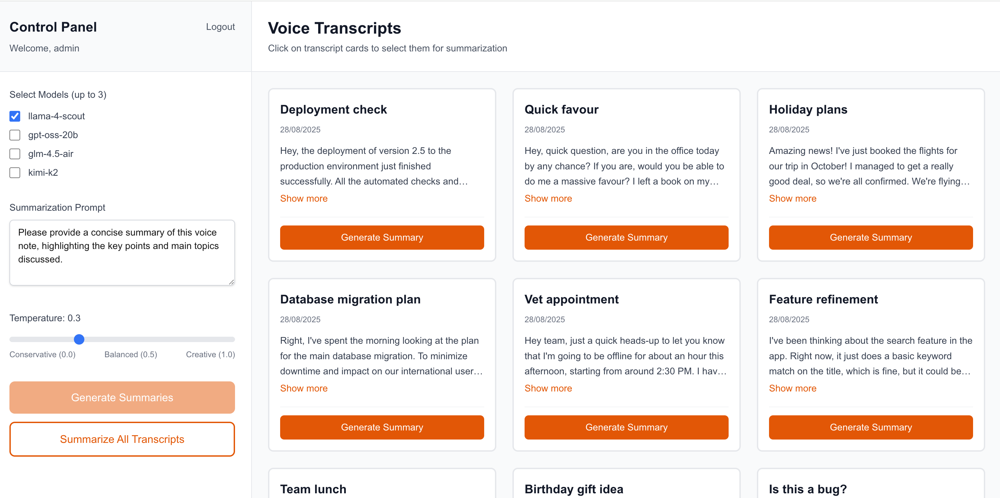
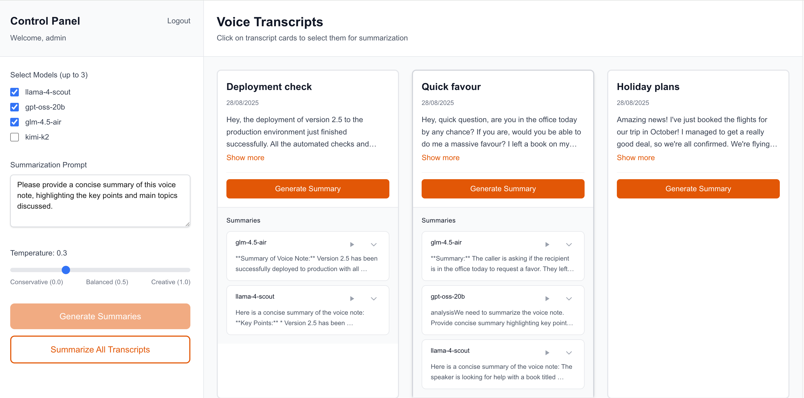
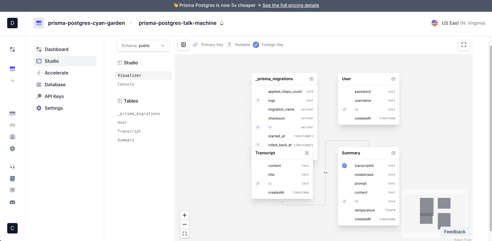
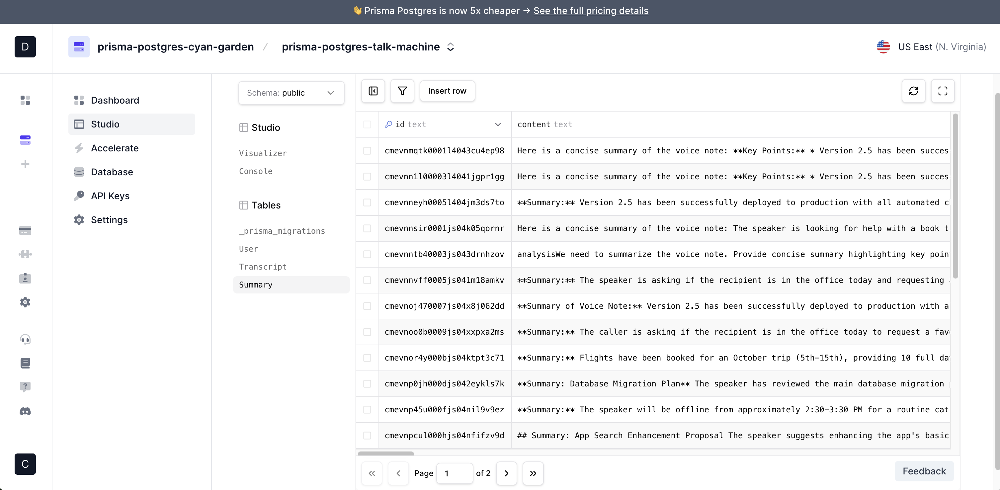
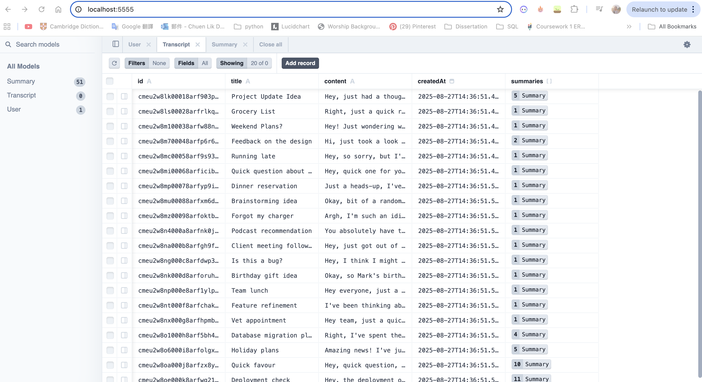
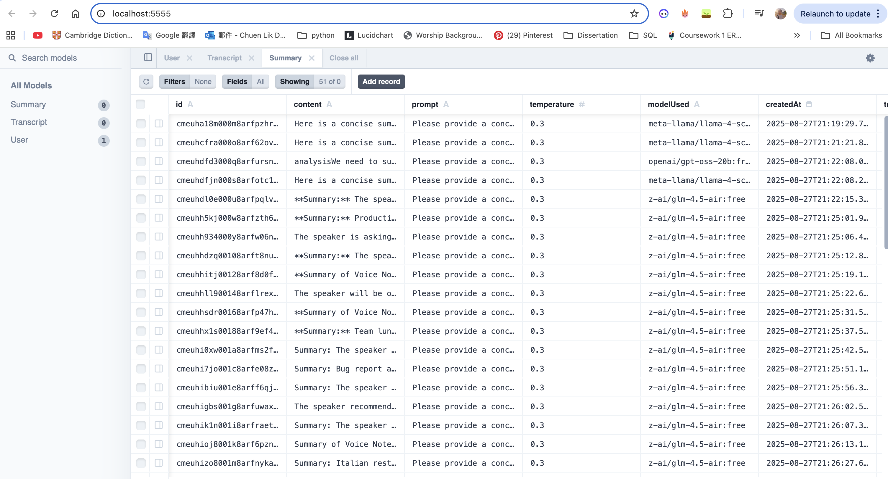

# Voice Note Summarizer - Technical Implementation

## Overview
A full-stack AI-powered application that enables users to generate and compare summaries for voice note transcripts using multiple Large Language Models (LLMs) via OpenRouter API.

**Version**: 3.0  
**Implementation Date**: August 28, 2025  
**Development Time**: 5-7 hours (including deployment and testing)

## Deployment

- **Platform**: Vercel
- **Environment**: .env configuration
- **Deployed URL**: https://voice-note-summariser.vercel.app/

## Tech Stack

### Frontend
- **Framework**: Next.js 15.5.2 (App Router)
- **React**: 19.1.0
- **Language**: TypeScript 5+
- **Styling**: Tailwind CSS v4
- **Build Tool**: Turbopack

### Backend
- **API**: Next.js API Routes
- **Runtime**: Node.js (serverless functions)
- **Validation**: Zod v4.1.3
- **Concurrency Control**: p-limit v7.1.0

### Database
- **Database**: PostgreSQL (Prisma local dev server + Vercel Prisma server)
- **ORM**: Prisma 6.15.0
- **Client**: @prisma/client 6.15.0

### AI Integration
- **Provider**: OpenRouter API
- **Models**: 
  - Meta Llama 4 Scout (Free)
  - OpenAI GPT OSS 20B (Free)
  - Z-AI GLM 4.5 Air (Free)
  - MoonshotAI: Kimi K2 (Free)
- **Text-to-Speech**: ElevenLabs API (@elevenlabs/elevenlabs-js v2.12.2)
  - Voice synthesis for summary playback
  - Multilingual support (eleven_multilingual_v2 model)
  - MP3 audio output (44.1kHz, 128kbps)

## Key Features
- **Authentication**: Simple username/password login system
- **Transcript Management**: View 20 pre-loaded voice note transcripts
- **AI Summarization**: Generate summaries using multiple LLM models via OpenRouter
- **Batch Processing**: Summarize all transcripts at once
- **Comparison View**: Compare summaries from different models side by side
- **Responsive Design**: Works on desktop and mobile devices
- **Text-to-Speech**: high-quality speech synthesis for summary playback

## Project Structure

```
src/
├── app/
│   ├── api/
│   │   ├── auth/route.ts          # Authentication endpoint
│   │   ├── transcripts/route.ts   # Transcript management
│   │   ├── summaries/route.ts     # Summary retrieval
│   │   ├── summarize/route.ts     # AI summarization
│   │   └── tts/route.ts           # Text-to-Speech conversion
│   ├── globals.css                # Global styles
│   ├── layout.tsx                 # Root layout
│   └── page.tsx                   # Main application entry
├── components/
│   ├── LoginForm.tsx              # Authentication UI
│   ├── VoiceNoteSummarizer.tsx    # Main application component
│   ├── LeftPanel.tsx              # Transcript list & batch ops
│   └── RightPanel.tsx             # Controls & comparison view
├── lib/
│   ├── prisma.ts                  # Database client
│   ├── constants.ts               # Shared constants
│   └── format.ts                  # Utility functions
└── types/
    └── index.ts                   # TypeScript definitions

prisma/
├── schema.prisma                  # Database schema
├── seed.ts                        # Database seeding script
└── migrations/                    # Database migrations

public/
└── voice_transcript.json          # Seed data (20 transcripts)
```


## API Endpoints

- `POST /api/auth` - User authentication
- `GET /api/transcripts` - Get all transcripts
- `GET /api/summaries?transcriptId=<id>` - Get summaries for a transcript
- `POST /api/summarize` - Generate new summaries
- `POST /api/tts` - Text-to-Speech conversion


## Setup Instructions (if running locally)

1. **Install dependencies**:
   ```bash
   npm install
   ```

2. **Configure environment variables**:
   - Open `.env` file
   - Replace `your-openrouter-api-key-here` with your actual OpenRouter API key
   - For production, update `APP_URL` to your domain

3. **Start the database** (if not already running):
   ```bash
   npx prisma dev
   ```

4. **Run database migrations**:
   ```bash
   npx prisma db push
   ```

5. **Seed the database**:
   ```bash
   npm run seed
   ```

6. **Start the development server**:
   ```bash
   npm run dev
   ```

7. **Access the application**:
   - Open http://localhost:3000 in your browser

## Future Updates of transcripts

When you modify voice_transcript.json, you'll need to:
1. Re-seed the database: npm run seed
2. Restart the dev server: npm run dev


## Screenshots

Main page:




Database:Prisma Studio (cloud):




Database: Prisma Studio (local):



## Any AI assistance I used and how

I used AI tools to support and accelerate my work, while ensuring that I remained in full control of the design and implementation decisions:

- Gemini 2.5 Pro — helped me draft a technical PRD (Product Requirements Document) to structure my approach to the project.
- Claude Code (Sonnet 4.0) — assisted with implementation by providing suggestions and code snippets, which I reviewed and adapted.
- Cursor with GPT-5 — supported debugging and testing, particularly when configuring the database (Prisma) for both local and cloud environments, and when troubleshooting the TTS functionality.

## Future Enhancements

### Suggested Improvements
1. **Authentication**: JWT tokens, session management
2. **Security**: Password hashing, CSRF protection
3. **Performance**: Response caching, request debouncing
4. **UI/UX**: Accessibility improvements, integrate with Shadcn UI, keyboard navigation
5. **Features**: Summary export, history tracking